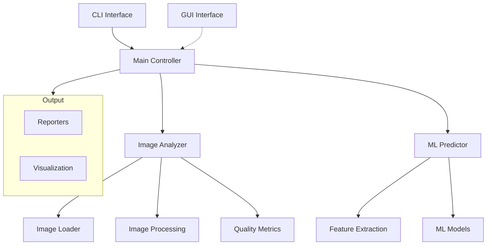

# System Patterns

## Архитектурные компоненты

## Ключевые подсистемы

### 1. Core
- **ImageAnalyzer**: Центральный компонент анализа
- **ImageLoader**: Загрузка изображений разных форматов
- **ImageProcessing**: Масштабирование и обработка
- **Metrics**: Вычисление метрик качества

### 2. ML
- **Predictor**: ML модели для быстрой оценки
- **FeatureExtraction**: Извлечение признаков
- **ModelTraining**: Обучение моделей

### 3. Utils
- **CLI**: Интерфейс командной строки
- **Reporters**: Форматирование и экспорт результатов
- **Visualization**: Генерация графиков
- **I18n**: Интернационализация

## Основные паттерны

### 1. Архитектурные паттерны
- **Strategy**: Для разных метрик качества и методов интерполяции
- **Factory**: Создание различных типов репортеров
- **Command**: Обработка CLI команд
- **Observer**: Для отслеживания прогресса обработки

### 2. Паттерны проектирования
- **Dependency Injection**: Конфигурация компонентов
- **Template Method**: Для различных этапов анализа
- **Chain of Responsibility**: Обработка ошибок
- **Builder**: Конструирование сложных отчетов

### 3. Паттерны взаимодействия
- **Publisher/Subscriber**: Для событий обработки
- **Iterator**: Для обхода коллекций результатов
- **Mediator**: Координация между компонентами
- **Facade**: Упрощение интерфейса для GUI

## Технические решения

### 1. Обработка изображений
- Нормализация значений в диапазоне [0, 1]
- Поддержка многоканальных изображений
- Эффективное масштабирование

### 2. Параллельная обработка
- Многопоточная обработка файлов
- Опциональное использование GPU
- Контроль за использованием ресурсов

### 3. Управление данными
- Кэширование промежуточных результатов
- Эффективная работа с большими файлами
- Управление памятью при обработке

## Расширяемость

### 1. Метрики качества
- Абстрактный интерфейс для метрик
- Легкое добавление новых метрик
- Конфигурируемые параметры

### 2. Форматы файлов
- Модульная система загрузчиков
- Поддержка метаданных
- Валидация форматов

### 3. Визуализация
- Настраиваемые графики
- Расширяемая система тем
- Различные форматы экспорта
