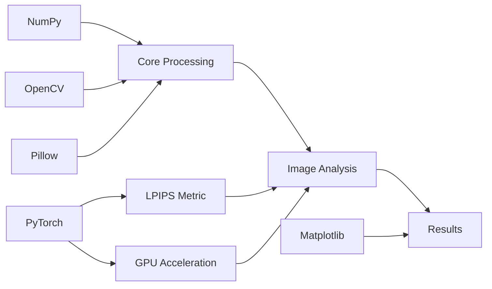
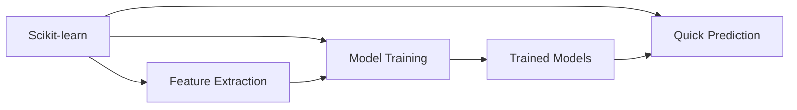

# Technical Context

## Технологический стек

### Основные технологии
- **Python 3.10+**: Основной язык разработки
- **NumPy**: Работа с массивами и численные вычисления
- **OpenCV**: Обработка изображений
- **Pillow**: Поддержка различных форматов изображений
- **PyTorch**: Вычисления на GPU и LPIPS метрика
- **Matplotlib**: Визуализация результатов
- **Scikit-learn**: ML компоненты

### Форматирование и типизация
- **mypy**: Статическая типизация
- **isort**: Сортировка импортов
- **pylint**: Линтер
- **Black**: Форматирование кода

### Тестирование
- **pytest**: Модульное тестирование
- **coverage**: Измерение покрытия кода тестами

### Локализация
- **gettext**: Система интернационализации
- Поддержка en/ru локалей

## Архитектурные зависимости

### Основные

### ML компоненты

## Технические ограничения

### Системные требования
- Python 3.10 или выше
- Достаточно RAM для обработки крупных изображений
- GPU опционально (для ускорения PyTorch)

### Форматы данных
- Поддержка EXR, TGA, PNG, JPEG
- Внутренняя нормализация [0, 1]
- Минимальный размер для анализа: 16x16

### Производительность
- Многопоточная обработка файлов
- Оптимизация памяти при масштабировании
- Кэширование промежуточных результатов

## Инструменты разработки

### IDE и редакторы
- VSCode с Python расширениями
- Поддержка virtualenv

### Системы контроля версий
- Git для управления кодом
- GitHub Actions для CI/CD

### Документация
- Google style docstrings
- README.md на английском
- Локализованная справка CLI

## Рабочий процесс

### Разработка
1. Создание feature веток
2. Следование style guide
3. Обязательное тестирование
4. Code review через PR

### Тестирование
1. Модульные тесты (pytest)
2. Coverage отчеты
3. Линтинг и type checking
4. Проверка локализации

### Деплой
1. Сборка пакета (python -m build)
2. Проверка сборки (twine check)
3. Очистка артефактов сборки
